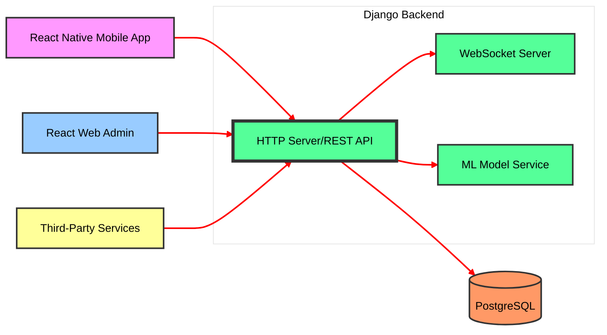

# 🛍️ Crimsotech - Used Electronics Marketplace

<div align="center">
  
  
  **A complete multi-platform ecosystem connecting buyers, sellers, and riders**  
  *Smart marketplace for pre-loved electronics*
</div>

---

## 📖 Table of Contents
- [Project Overview](#-project-overview)
- [System Architecture](#-system-architecture)
- [Tech Stack](#-tech-stack)
- [Project Structure](#-project-structure)
- [Quick Start Guide](#-quick-start-guide)
- [Key Features](#-key-features)
- [Platform Walkthrough](#-platform-walkthrough)

---

## 🎯 Project Overview

Crimsotech is a comprehensive marketplace platform designed to create a seamless ecosystem for buying, selling, and delivering used electronics. The platform leverages:

- **🤖 AI-Powered Classification**: Automatic product categorization using machine learning
- **📱 Cross-Platform Experience**: Native mobile apps for end-users and web dashboard for administrators
- **💰 Integrated Wallet System**: Secure digital payments and transaction management
- **🚚 Real-Time Tracking**: Live order tracking with WebSocket-powered updates

---

## 🏗 System Architecture



### Core Components

#### 1️⃣ **Backend Engine** (`crimsotech_django`)
- **Framework**: Django + Django REST Framework
- **Database**: PostgreSQL with SQLite development support
- **Real-time**: Django Channels for WebSocket communications
- **ML Integration**: TensorFlow/Keras model for product classification

#### 2️⃣ **Mobile Application** (`crimsotech_react_native`)
- **Buyer Interface**: Browse, search, purchase, and track orders
- **Seller Dashboard**: Manage inventory, sales, and promotions
- **Rider Portal**: Accept deliveries, manage routes, track earnings
- **Moderator Tools**: Oversee platform operations and approvals

#### 3️⃣ **Admin Dashboard** (`crimsotech-app`)
- **System Analytics**: Real-time platform metrics and reports
- **User Management**: Oversee all user accounts and roles
- **Transaction Monitoring**: Track payments and dispute resolution
- **Content Moderation**: Review listings and user-generated content

---

## 🛠 Tech Stack

| Component | Technology Stack | Key Features |
|:----------|:-----------------|:-------------|
| **Backend** | Python 3.x, Django, DRF, PostgreSQL, Redis | REST APIs, WebSockets, Authentication, ML Integration |
| **Mobile** | React Native, Expo, React Navigation, Axios | Cross-platform, Offline Support, Push Notifications |
| **Web Admin** | React 18, TypeScript, TailwindCSS, React Router | Responsive Design, Real-time Updates, Analytics |
| **DevOps** | Docker, Nginx, Gunicorn, GitHub Actions | Containerization, CI/CD, Auto-scaling |
| **ML & AI** | TensorFlow, Keras, scikit-learn, Pandas | Product Classification, Recommendation Engine |

---

## 📂 Project Structure

### 🎯 Backend Core (`crimsotech_django/`)
```
backend/
├── api/                    # Main application logic
│   ├── models/            # Database models (User, Product, Order, etc.)
│   ├── views/             # API endpoints & business logic
│   ├── serializers/       # Data validation & transformation
│   ├── consumers/         # WebSocket handlers
│   └── permissions/       # Role-based access control
├── backend/               # Project configuration
│   ├── settings/          # Environment-specific settings
│   ├── urls.py           # Root URL configuration
│   └── asgi.py           # Async server configuration
├── model/                 # ML models
│   └── electronics_classifier3.keras
├── dataset/               # Training data
├── static/                # Static files
├── media/                 # User-uploaded content
├── manage.py
└── requirements.txt
```

### 📱 Mobile Application (`crimsotech_react_native/`)
```
app/
├── (auth)/                # Authentication flow
│   ├── login.tsx
│   ├── register.tsx
│   └── verify-phone.tsx
├── customer/              # Buyer interface
│   ├── home/             # Product discovery
│   ├── cart/             # Shopping cart
│   ├── checkout/         # Payment processing
│   └── orders/           # Order history & tracking
├── seller/               # Shop management
│   ├── dashboard/        # Analytics & overview
│   ├── products/         # Inventory management
│   ├── earnings/         # Sales & revenue
│   └── vouchers/         # Promotional tools
├── rider/                # Delivery operations
│   ├── deliveries/       # Active deliveries
│   ├── schedule/         # Shift management
│   └── earnings/         # Trip history & payments
├── moderator/            # System oversight
│   ├── approvals/        # Shop/rider applications
│   └── analytics/        # Platform monitoring
├── contexts/             # Global state
│   ├── AuthContext.tsx
│   └── ShopContext.tsx
└── assets/              # Images, fonts, icons
```

### 🌐 Web Admin Panel (`crimsotech-app/`)
```
app/
├── routes/               # Page components
│   ├── dashboard.tsx
│   ├── users.tsx
│   ├── transactions.tsx
│   └── analytics.tsx
├── components/          # Reusable UI components
├── lib/                 # Utilities & helpers
├── styles/             # Global styles & themes
├── root.tsx            # Root layout
├── routes.ts           # Route definitions
└── middleware.ts       # Auth & session management
```

---

## 🚀 Quick Start Guide

### Prerequisites
- Python 3.8+
- Node.js 16+
- npm/yarn
- PostgreSQL (optional, SQLite works for development)

### Step-by-Step Setup

#### 1. **Backend Setup** 🐍
```bash
# Clone and navigate to backend
cd crimsotech_django/backend

# Create virtual environment
python -m venv venv
source venv/bin/activate  # Windows: venv\Scripts\activate

# Install dependencies
pip install -r requirements.txt

# Set up database
python manage.py migrate
python manage.py createsuperuser

# Start development server
python manage.py runserver
# Backend running at: http://localhost:8000
```

#### 2. **Admin Panel Setup** 🖥️
```bash
cd crimsotech-app

# Install dependencies
npm install

# Start development server
npm run dev
# Admin panel running at: http://localhost:5173
```

#### 3. **Mobile App Setup** 📱
```bash
cd crimsotech_react_native

# Install dependencies
npm install

# Start Expo development server
npx expo start

# Scan QR code with Expo Go app (Android/iOS)
# or run on specific platform:
npx expo run:android  # For Android
npx expo run:ios      # For iOS
```

Here are the environment configuration templates for each component:

---

## 🔧 Environment Configuration

### Backend (Django) - `crimsotech_django/backend/.env.example`

```env
# Django Core
SECRET_KEY=<your-secret-key>
DEBUG=True
ALLOWED_HOSTS=localhost,127.0.0.1

# Database
POSTGRES_DB=<database-name>
POSTGRES_USER=<database-user>
POSTGRES_PASSWORD=<database-password>
POSTGRES_HOST=localhost
POSTGRES_PORT=5432

# Redis (Cache & WebSockets)
REDIS_URL=<redis-connection-url>

# Twilio (SMS Verification)
TWILIO_ACCOUNT_SID=<your-twilio-account-sid>
TWILIO_AUTH_TOKEN=<your-twilio-auth-token>
TWILIO_SERVICE_ID=<your-verify-service-id>

# Supabase Storage
SUPABASE_STORAGE_BUCKET=<bucket-name>
SUPABASE_ACCESS_KEY=<your-access-key>
SUPABASE_SECRET_KEY=<your-secret-key>
SUPABASE_ENDPOINT=<supabase-endpoint-url>
SUPABASE_REGION=<storage-region>

# Payment Gateway (Maya)
MAYA_PUBLIC_KEY=<your-public-key>
MAYA_SECRET_KEY=<your-secret-key>
ENABLE_SANDBOX=True

# Frontend
FRONTEND_URL=http://localhost:5173

# SMS Provider
SMS_PH_API_KEY=<your-sms-api-key>
```

---

### Web Admin Panel - `crimsotech-app/.env.example`

```env
# API Configuration
VITE_API_BASE_URL=<backend-api-url>
VITE_MEDIA_URL=<backend-media-url>
VITE_WEBSOCKET_URL=<websocket-server-url>

# Feature Flags
VITE_ENABLE_SANDBOX=<true|false>
```

---

### Mobile Client - `crimsotech_react_native/.env.example`

```env
# API Configuration
EXPO_PUBLIC_API_URL=<backend-api-url>
```

---

## ⚙️ Setup Instructions

1. Copy the template files:
   ```bash
   # Backend
   cp crimsotech_django/backend/.env.example crimsotech_django/backend/.env
   
   # Web Admin
   cp crimsotech-app/.env.example crimsotech-app/.env
   
   # Mobile
   cp crimsotech_react_native/.env.example crimsotech_react_native/.env
   ```

2. Replace placeholder values (`<...>`) with actual credentials

3. **Never commit `.env` files** - add to `.gitignore`:
   ```
   .env
   .env.local
   .env.*.local
   ```
---

## ✨ Key Features

### 🔐 **Authentication & Security**
- Phone number verification with OTP
- Role-based access control (RBAC)
- Secure password hashing

### 💳 **Wallet System**
- Digital wallet for all users
- Instant transaction history
- Automatic payment splitting
- Refund handling

### 🤖 **AI-Powered Features**
- Automatic product categorization
- Price recommendation engine
- Fraud detection system
- Image quality assessment

### 📊 **Analytics Dashboard**
- Real-time sales metrics
- User behavior analytics
- Delivery performance tracking
- Revenue forecasting

### 🔔 **Real-Time Features**
- Live order tracking with WebSockets
- Push notifications for updates
- In-app messaging system
- Live support chat

---

## 👥 Platform Walkthrough

### 👨‍💼 **For Administrators**
- Monitor platform health and metrics
- Manage user accounts and roles
- Review flagged content
- Handle dispute resolution
- Generate financial reports

### 🛒 **For Buyers**
- Browse categorized electronics
- AI-powered product search
- Secure checkout with wallet
- Real-time order tracking
- Rate and review sellers

### 🏪 **For Sellers**
- Easy product listing with AI assistance
- Inventory management system
- Sales analytics dashboard
- Voucher and promotion tools
- Customer communication

### 🚚 **For Riders**
- Accept/reject delivery requests
- Optimized route planning
- Earnings tracker with tipping
- Delivery proof capture
- Performance metrics

---


## 📞 Support & Contact

- **Email Support**: crimsotech@gmail.com

---

<div align="center">
  <sub>Built with ❤️ by the Crimsotech Team</sub>
</div>
